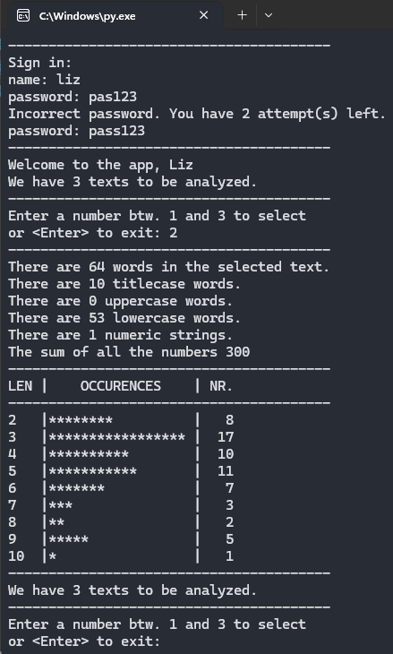
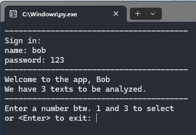
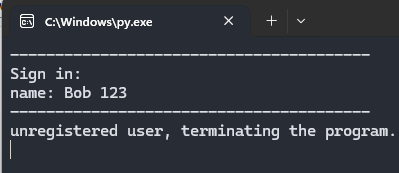
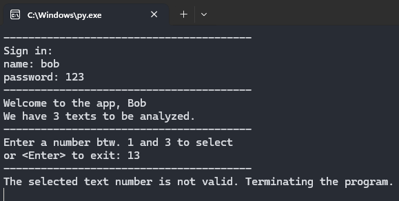
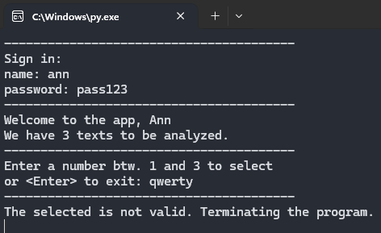

# Textový analyzátor
**První projekt do Engeto Online Python Akademie**

## Cíl
Cílem tohoto projektu je vytvořit ***textový analyzátor*** - program, který se bude umět 
prokousat libovolně dlouhým textem a zjistit o něm různé informace.

## Instalace a spuštění
1. Naklonujte tento repozitář:
   ```bash
   git clone https://github.com/tvoje-uzivatelske-jmeno/projekt1.git
2. Ujistěte se, že máte nainstalovaný Python 3.
3. Spusťte skript: **python projekt_1.py**
**Poznámka:** Projekt vyžaduje soubor *task_template.py*, který obsahuje proměnnou TEXTS.

## Co tento program dokáže
- Ověřit uživatele pomocí přihlašovacího jména a hesla
- Nechá uživatele vybrat mezi třemi texty
- Pro vybraný text spočítá následující statistiky:
  - počet slov
  - počet slov začínajících velkým písmenem
  - počet slov psaných velkými písmeny
  - počet slov psaných malými písmeny
  - počet čísel (ne cifer)
  - sumu všech čísel (ne cifer) v textu

## Příklad použití
Po spuštění programu budete vyzváni k přihlášení a poté k výběru textu pro analýzu.



## Omezení a varování
- Pokud uživatel je registrovaný, program umožni mu analyzovat texty
  
  
  
- Pokud není registrovaný, program upozorni jej a skončí

  

- Pokud uživatel vybere takové číslo textu, které není v zadání, program jej upozorní a skončí

  

- Pokud uživatel zadá jiný vstup než číslo, program jej rovněž upozorní a skončí

  

### Autor
* [Yehor Baranov](https://github.com/JehorB)
